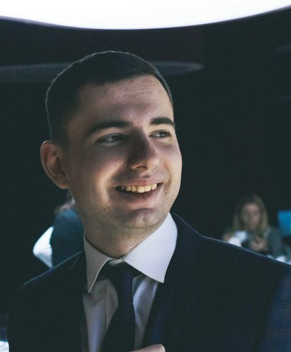

# Kirill Kasabutski



## Junior Frontend Developer

***

## Contact information:

**Phone:** +375 25 544 23 82

**Email:** ef.hayne@gmail.com

**Telegram:** @mekishi

**GitHub:** @OldBear1993

***

## About me:

I am a hardworking and ambitious individual with a great passion for IT. I am currently studying Frontend speciality at Rolling Scopes courses. I have excellent communication skills, enabling me to effectively communicate with a wide range of people. I am looking for a full-time position in the industry in which I can put my knowledge and experience into practice, which will ultimately benefit the operations of the organisation that I work for.

***

## Skills and Proficiency:

* HTML5
* CSS3
* JavaScript
* Git, GitHub
* MJML

***

## Code example:

```
function narcissistic(value) {
  const arr = value.toString().split('');
  let a = 0;
  
  for (let x = 0; x < arr.length; x++ ) {
    a = Math.pow(arr[x], arr.length) + a;
  }
  
  if (a == value) {
    return true;
    console.log(value + " is nartcissistic");
  } else {
    return false;
    console.log(value + " is not nartcissistic")
  }
}
```

***

## Courses:

* HTML, CSS and JavaScript on SoloLearn (completed)
* RS Schools Course «JavaScript/Front-end. Stage 0» (in progress)

***

## Languages:

* English - Intermediate/Upper-intermediate


* Russian - Native

***

## Projects:

* [rsschool-cv](https://github.com/OldBear1993/rsschool-cv)
